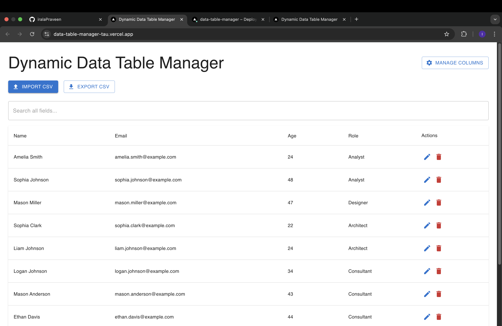
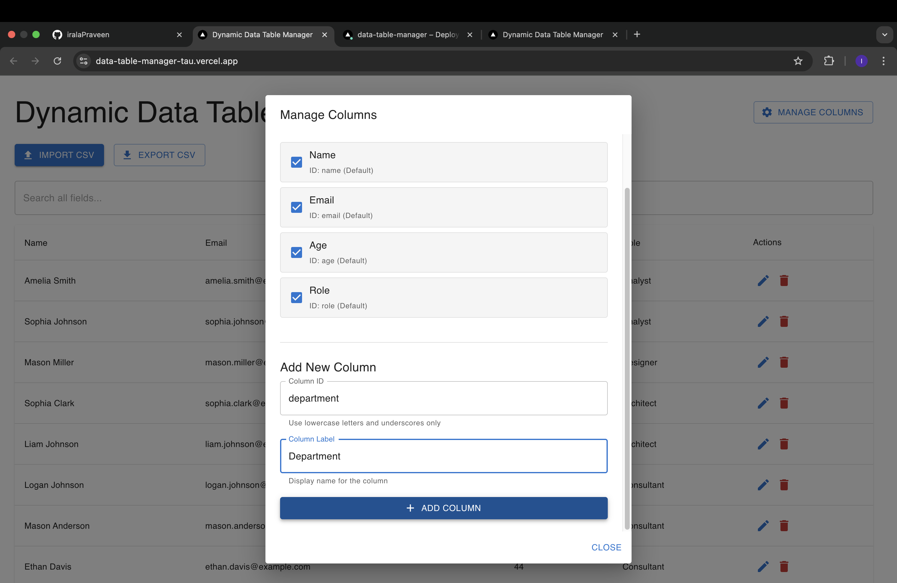
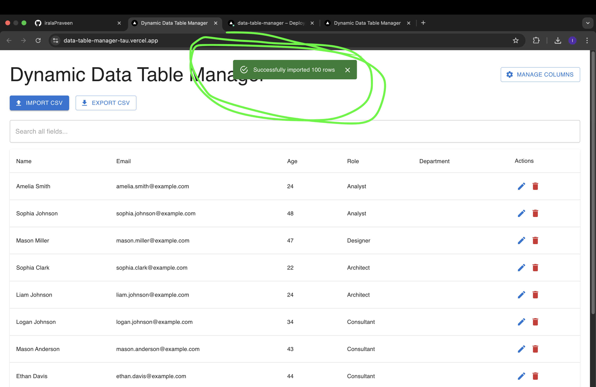
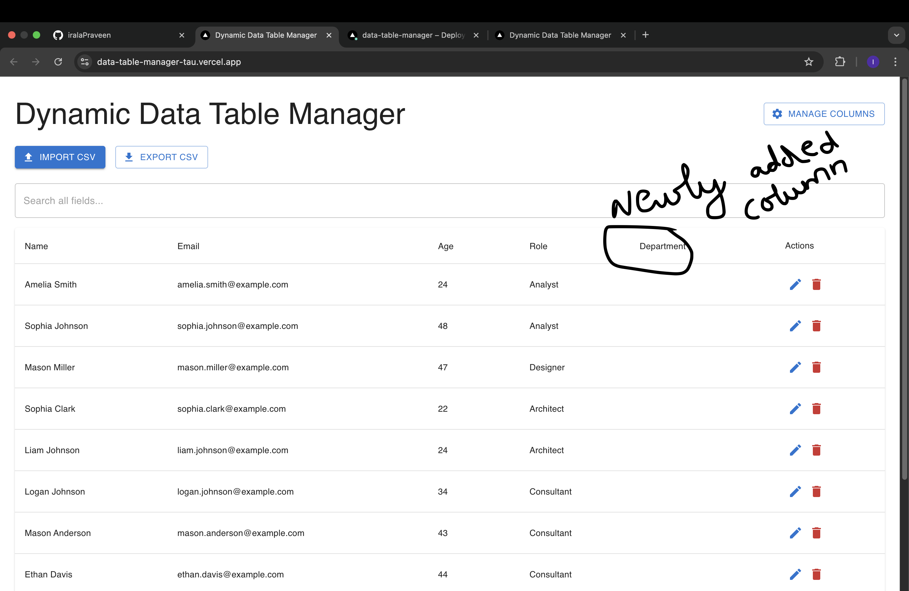
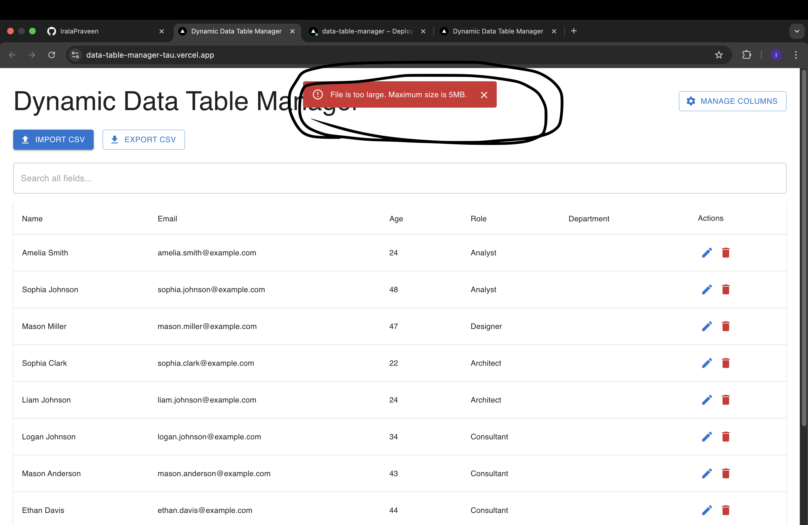

# Dynamic Data Table Manager

A production-ready data table application built with Next.js 14, Redux Toolkit, and Material UI. Features CSV import/export, dynamic column management, real-time search, sorting, and pagination.

[Live Demo](https://data-table-manager-tau.vercel.app/) 

---

## 📋 Table of Contents

- [Features](#features)
- [Tech Stack](#tech-stack)
- [Getting Started](#getting-started)
- [Installation](#installation)
- [Usage](#usage)
- [Project Structure](#project-structure)
- [Build for Production](#build-for-production)
- [Deployment](#deployment)
- [Features Breakdown](#features-breakdown)
- [Sample CSV Format](#sample-csv-format)
- [Contributing](#contributing)
- [License](#license)
- [Contact](#contact)

---

## ✨ Features

### Core Features
- ✅ **Table View** with sorting, searching, and pagination
- ✅ **Dynamic Column Management** - Add, remove, show/hide columns
- ✅ **CSV Import** with comprehensive validation and error handling
- ✅ **CSV Export** with visible columns only
- ✅ **Global Search** across all fields
- ✅ **Column Sorting** (ascending/descending toggle)
- ✅ **Client-side Pagination** (10 rows per page)
- ✅ **Row Deletion** with confirmation dialog
- ✅ **State Persistence** using Redux Persist
- ✅ **Responsive Design** using Material UI

### Validation & Error Handling
- File type validation (CSV only)
- File size validation (max 5MB)
- Required columns validation
- Email format validation
- Age range validation (0-150)
- Empty file detection
- User-friendly error messages via Snackbar

### Bonus Features
- 🔒 Protected default columns (cannot be deleted)
- 💾 Column visibility persistence across sessions
- 🎨 Modern Material UI design
- ⚡ Optimized production build
- 🔍 Real-time search feedback
- 📱 Mobile-responsive layout

---

## 🛠️ Tech Stack

### Frontend Framework
- **Next.js 14** - React framework with App Router
- **React 18** - UI library
- **TypeScript** - Type safety

### State Management
- **Redux Toolkit** - State management
- **Redux Persist** - State persistence

### UI Components
- **Material UI v5** - Component library
- **Emotion** - CSS-in-JS styling

### Data Processing
- **PapaParse** - CSV parsing
- **FileSaver.js** - CSV export

### Development Tools
- **ESLint** - Code linting
- **TypeScript ESLint** - TypeScript linting
- **React Hook Form** - Form validation (optional)

---

## 🚀 Getting Started

### Prerequisites

Before you begin, ensure you have the following installed:
- **Node.js** (v18.0 or higher)
- **npm** (v9.0 or higher) or **yarn**

### Installation

1. **Clone the repository**
2. **Install dependencies**
3. **Run the development server**

4. **Open your browser**

Navigate to [http://localhost:3000](http://localhost:3000)

---

## 💻 Usage

### Importing Data

1. Click the **"Import CSV"** button
2. Select a CSV file with the required columns: `name`, `email`, `age`, `role`
3. The system validates and imports your data
4. View success/error notifications at the top of the screen

### Managing Columns

1. Click **"Manage Columns"** button
2. **Toggle visibility** using checkboxes
3. **Add new columns** (e.g., Department, Location)
4. **Delete custom columns** using the trash icon
5. Default columns (Name, Email, Age, Role) are protected

### Searching & Sorting

- Use the **search box** to filter records across all fields
- Click **column headers** to sort (toggle ASC/DESC)
- Sorting works on all data types (text, numbers, dates)

### Deleting Rows

1. Click the **delete icon** (trash) next to any row
2. Confirm deletion in the popup dialog
3. The row is permanently removed

### Exporting Data

1. Click **"Export CSV"** button
2. Only visible columns are exported
3. File downloads automatically with timestamp

---

## 📁 Project Structure

### Source Code (`src/`)
- **app/** - Next.js App Router pages and components
  - **components/** - Reusable React components
    - `DataTable.tsx` - Main table component with sorting and pagination
    - `ImportExport.tsx` - CSV import/export functionality
    - `ColumnManager.tsx` - Column management modal
    - `ReduxProvider.tsx` - Redux store provider wrapper
    - `ThemeRegistry.tsx` - Material UI theme configuration
  - `layout.tsx` - Root layout with providers
  - `page.tsx` - Home page component

- **redux/** - State management
  - `store.ts` - Redux store configuration with Redux Persist
  - `tableSlice.ts` - Table state slice with reducers
  - `hooks.ts` - Typed Redux hooks (useAppDispatch, useAppSelector)

- **types/** - TypeScript type definitions
  - `table.ts` - Interfaces for TableRow, ColumnConfig, TableState

- **utils/** - Utility functions
  - `csvHandler.ts` - CSV parsing and export logic with validation

### Configuration Files
- `next.config.mjs` - Next.js configuration
- `tsconfig.json` - TypeScript compiler options
- `package.json` - Project dependencies and scripts
- `README.md` - Project documentation

## NOTE

### Required Columns
- `name` - String (required)
- `email` - Valid email format (required)
- `age` - Number between 0-150 (required)
- `role` - String (required)

### Optional Columns
- `department` - String
- `location` - String
- Any custom fields you add

## 📸 Screenshots

### Main Dashboard

### Add Column

### Import CSV

### Column Management

### Error handling

